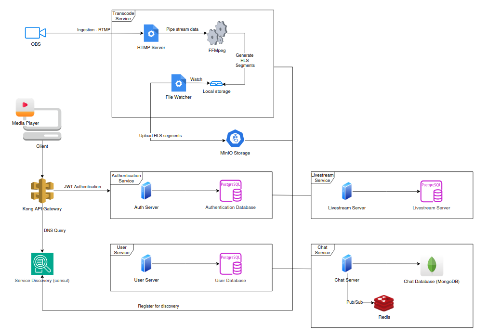
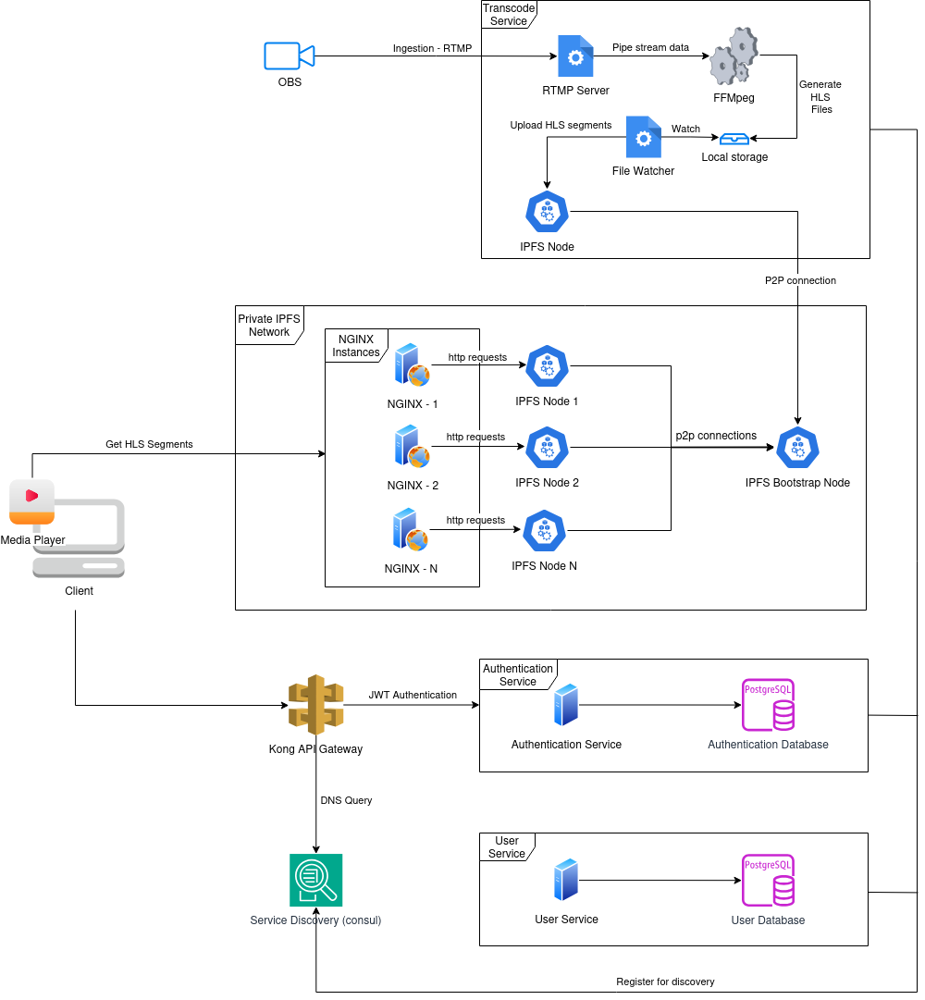

# LETS LIVE

## ABOUT
This is a project about livestreaming techonologies and solutions related to livestreaming.
The project aims to create a functioning livestreaming website from a to z like Twitch.

## HOW IT WORKS
- Ingestion: The RTMP is used to get the content of the livestream through OBS  
- Transcode: From the RTMP, use FFMpeg to generate the HLS files which also has adaptive bitrate streaming (ABS) for 360p, 720p and 1080p  
- When files are generated, segments are stored:  
  * Directly serving files, easy but will put a burden on transcode server.  
  * Push files into a remote storage, which we are using MinIO.  
  * Using a IPFS private network, I have implemented it but only for "using IPFS" demo purpose, otherwise there are no real usecases for using IPFS in livestreaming system, maybe except VOD  

## TECHNOLOGIES AND TOOLS
- Golang, PostgresQL.
- FFMpeg for transcoding from RTMP to HLS.
- Consul for service discovery and Kong for API Gateway.
- Storage: IPFS or MinIO.
- Docker and Docker Compose for up and running.
- NextJS, ReactJS and TailwindCSS for UI.

## ARCHITECTURE  
### WITH MINIO  

### WITH IPFS (no longer support cause usability)

## PORTS
- 8000: The main API endpoints.
- 1935: The RTMP default port (for stream ingestion)  
- 8889: The web server port (use to get the index.m3u8 and stream.m3u8 files)
- 8888: The port to get .ts files (This port uses nginx as a reverse proxy to get file from the IPFS network)  
- 5000: Web UI  
- 4001: IPFS bootstrap node port (allows other nodes outside the network to connect in)
- 5601: Kibana port for logging
- 8002: Kong API gateway management.
- 3000: Grafana for IPFS.

## INSTALLATION (LOCAL)
1. Clone the repo
2. Fill in the example env files in backend services
3. Run "mvn clean install" in backend/configserver
4. Run "docker compose up"
5. Access UI at localhost:5000

## ROADMAP

* Support streaming from browser.
* gRPC support.
* Kafka
* Add unit tests
* Add logging and tracing

Last editted: 11/03/2025  
**[Editor: Nam Huynh](https://github.com/ThNam203)**
