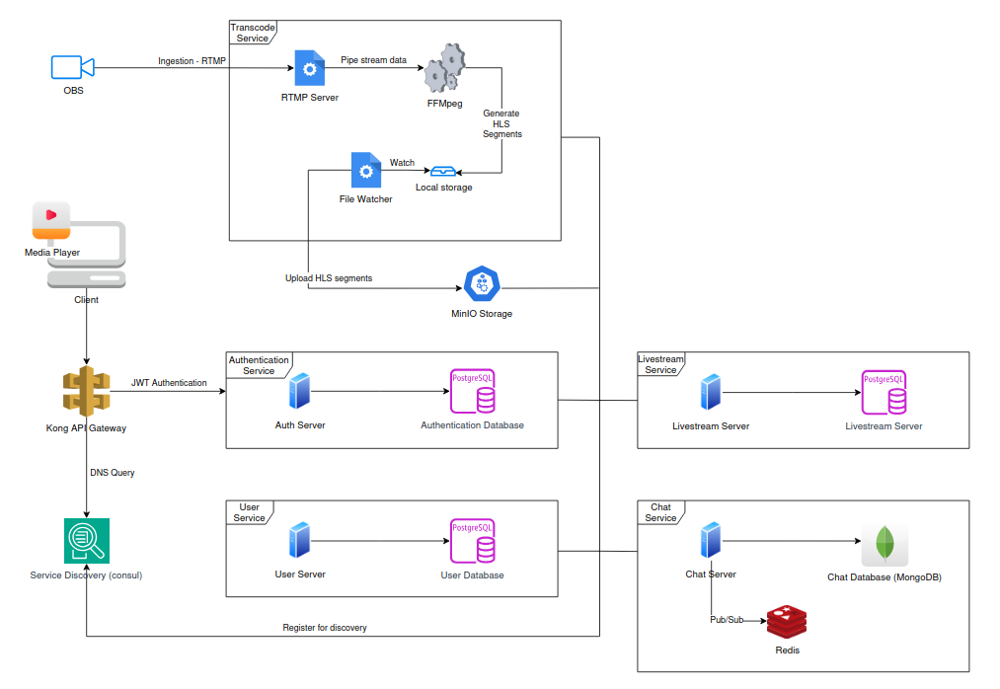
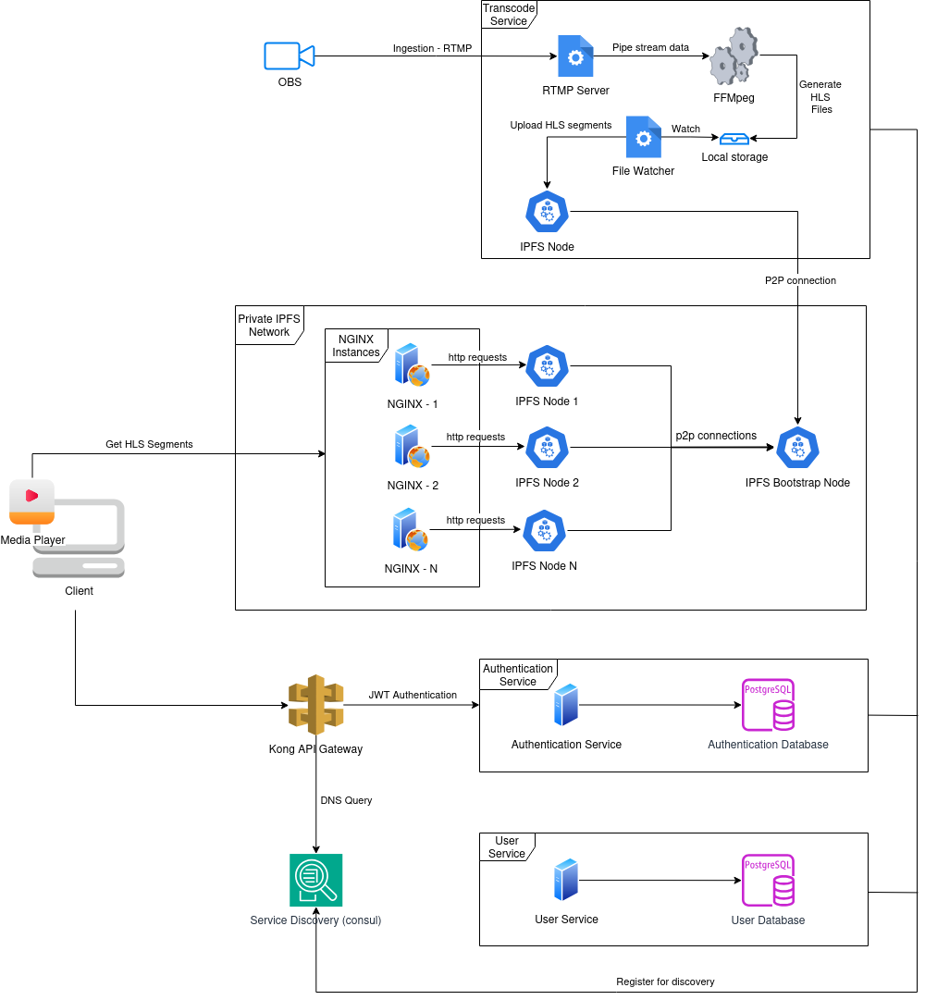

# LETS LIVE

## ABOUT

This is a project about livestreaming techonologies and solutions related to livestreaming.
The project aims to create a functioning livestreaming website from a to z like Twitch.

## HOW IT WORKS

- Ingestion: The RTMP is used to get the content of the livestream through OBS
- Transcode: From the RTMP, use FFMpeg to generate the HLS files which also has adaptive bitrate streaming (ABS) for 360p, 720p and 1080p
- When files are generated, segments are stored:
  - Directly serving files, easy but will put a burden on transcode server.
  - Push files into a remote storage, which we are using MinIO.
  - Using a IPFS private network, I have implemented it but only for "using IPFS" demo purpose, otherwise there are no real usecases for using IPFS in livestreaming system, maybe except VOD

## TECHNOLOGIES AND TOOLS

- Golang, PostgresQL.
- FFMpeg for transcoding from RTMP to HLS.
- Consul for service discovery and Kong for API Gateway.
- Storage: MinIO (IPFS not supported anymore).
- Docker and Docker Compose for up and running.
- NextJS, ReactJS and TailwindCSS for UI.
- Grafana Loki + Tempo for logging and tracing.

## ARCHITECTURE

### WITH MINIO

### WITH IPFS (no longer support cause usability)

## PORTS

- 8000: The main API endpoints/Gateway port.
- 1935: The RTMP default port (for stream ingestion)
- 8889: The web server port (use to get the index.m3u8 and stream.m3u8 files)
- 8888: The port to get .ts files (This port uses nginx as a reverse proxy to get file from the IPFS network).
- 5000: Web Client.
- 4001: IPFS bootstrap node port (allows other nodes outside the network to connect in)
- 8002: Kong API gateway management.
- 12345: Grafana for logging and tracing.

## INSTALLATION (LOCAL)

1. Clone the repo
2. Fill in the example.env file with your
3. Change the jwt_secrets.secret as same as your access token secret
4. Uncomment the "web" service in docker compose if I comment it out
5. Run "docker compose up"
6. Access web client at localhost:5000

## DEPLOYMENT

Before you deploy (including the GitHub Actions **deploy** workflow on a self-hosted runner), double-check [`configs/kong.yml`](./configs/kong.yml):

1. **Access token key** — Access tokens are signed with ES256. Generate a key once (`openssl ecparam -name prime256v1 -genkey -noout | openssl pkcs8 -topk8 -nocrypt | base64 | tr -d '\n'`) and store it as the `ACCESS_TOKEN_PRIVATE_KEY` GitHub secret / env var of the auth service. The other services fetch the public half from auth's JWKS endpoint (`JWKS_URL`, default `http://auth:7777/v1/.well-known/jwks.json`). Under `consumers` → `jwt_secrets`, `rsa_public_key` must hold that public key; the deploy workflow derives it from the secret and replaces the placeholder block.
2. **CORS origins** — Under `plugins` → `cors` → `config`, set `origins` to the real browser origins that call the API (for example your production and staging site URLs). With `credentials: true`, do not rely on `["*"]` for production; browsers require explicit allowed origins.

## Web client — mock API (optional)

To work on the **Next.js** UI without Docker or the Go API, use the mock flow: from the [`web`](./web) directory run `npm install` and then `npm run dev:mock`. That loads `.env.mock` and serves the app with [MSW](https://mswjs.io/) intercepting backend calls in the browser. More detail is in [`web/README.md`](./web/README.md). The mobile app does not use this setup yet.

Last edited: 04/05/2026  
**[Editor: Nam Huynh](https://github.com/ThNam203)**
